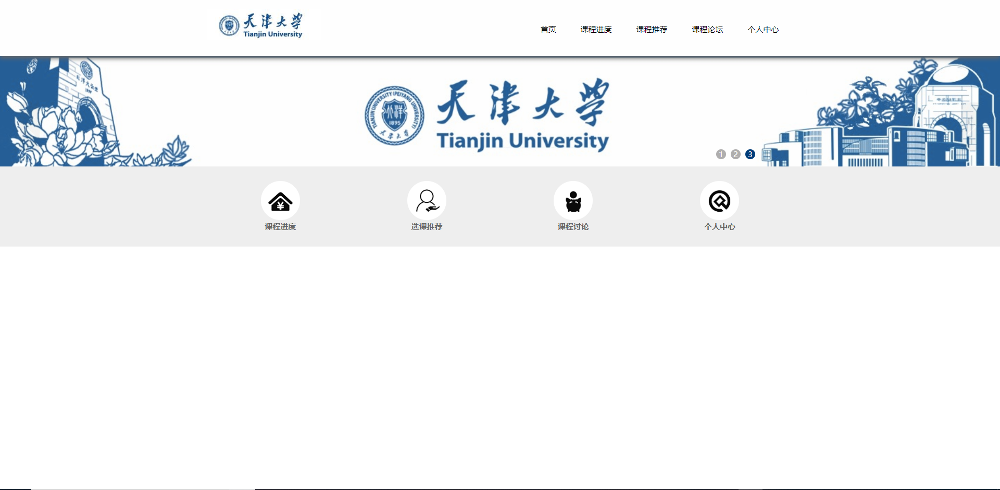
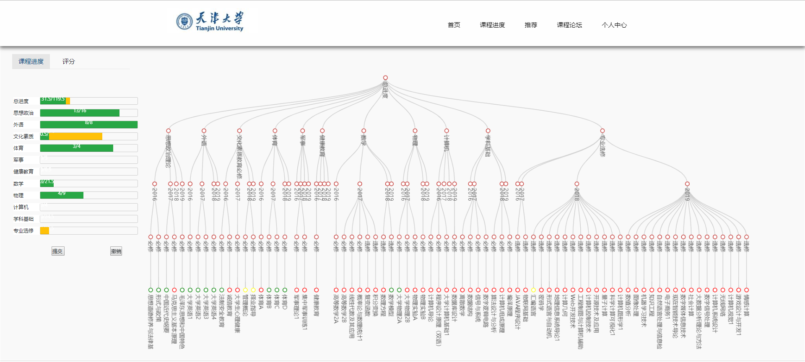
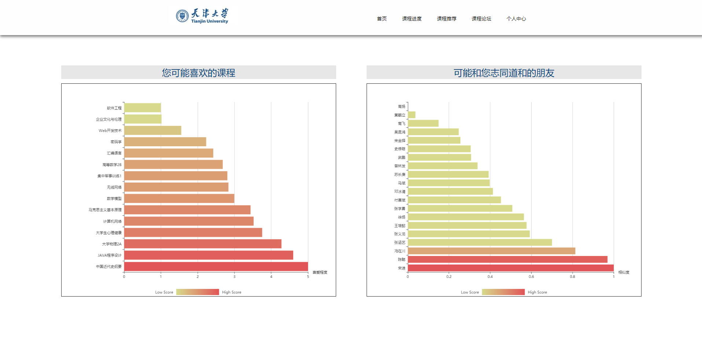
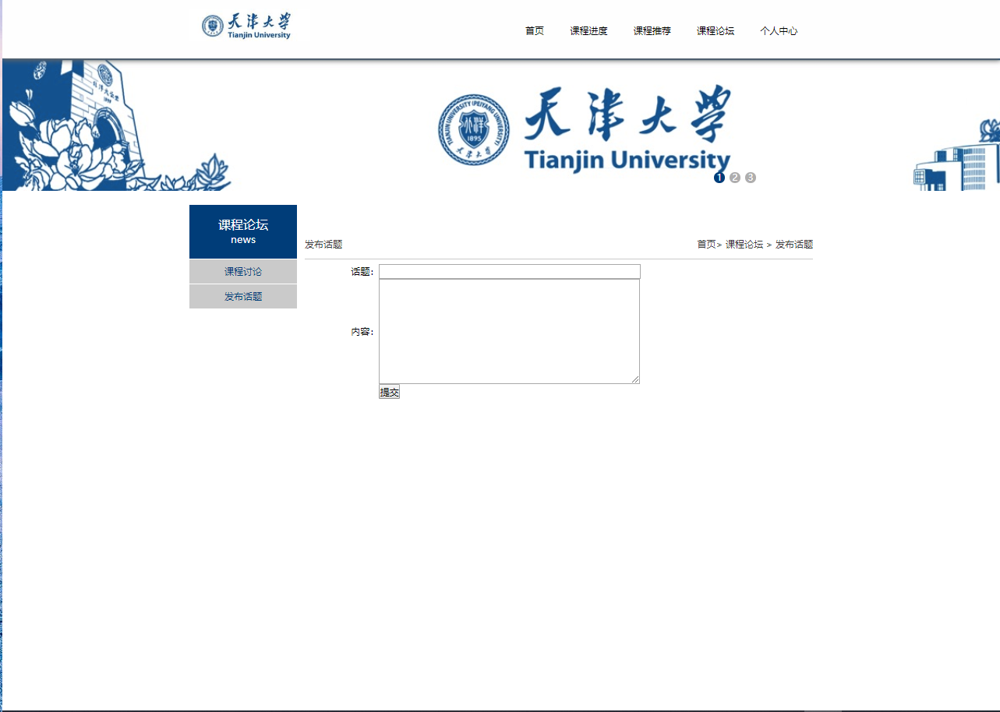

# 项目功能
* 学生培养计划可视化，学生能够直观地了解个人的培养计划进度情况和学分信息，从而更加有针对性地选择课程。
* 使用SVD算法，可根据其他用户的课程评价及选课情况，向用户个性化地推荐课程，分享志同道合的朋友。
* 通过论坛模块，学生还可以在课程讨论区交流想法，答疑解。
* 模拟选课退课，提前把握自己的学业进度.
# 项目目录
```
|—— sql         # 存放相关数据库sql语句
|—— static      # 存放静态资源文件
|—— |—— css    
|—— |—— images
|—— |—— js
|—— templates   # 存放html文件
|—— |—— *.html
|—— utils       # 存放一些功能函数
|—— config.py
|—— errors.py
|—— main.py
```
# 项目环境
- Python:3.x
- mysql:5.7
- Flask:1.0x
- numpy
# 使用
- 克隆项目
```
git clone https://github.com/gsolvit/studentTrainPlan.git
```
- 安装相关库
```
pip install Flask
pip install numpy
```
- 初始化数据库
    - 来到`sql/目录下`命令行进入mysql
    ```
    mysql -u 'userName' -p 
    ```
    - 创建数据库
    ```
    create database studenttrainplan;
    ```
    - 插入数据
    ```
    use studenttrainplan;
    source schema.sql;
    source insert_student.sql;
    source insert_loginformation.sql;
    source insert_education_plan.sql;
    source insert_choose.sql;
    source insert_edu_stu_plan.sql;
    ```
- 回到主目录
    - 修改`config.py`中
    ```
    config = {
        'default': Config,
        'MYSQL_PASSWORD': '123456',
        'DATABASE_NAME': 'studentTrainPlan'
    }
    ```
    `MYSQL_PASSWORD`字段为自己数据库密码.
    - 执行
    ```
    python main.py
    ```
- 打开浏览器,输入
```
localhost:5000
```
# 部署
参考[博客](https://blog.csdn.net/qq_40423339/article/details/86606308#commentsedit)

# 效果图










